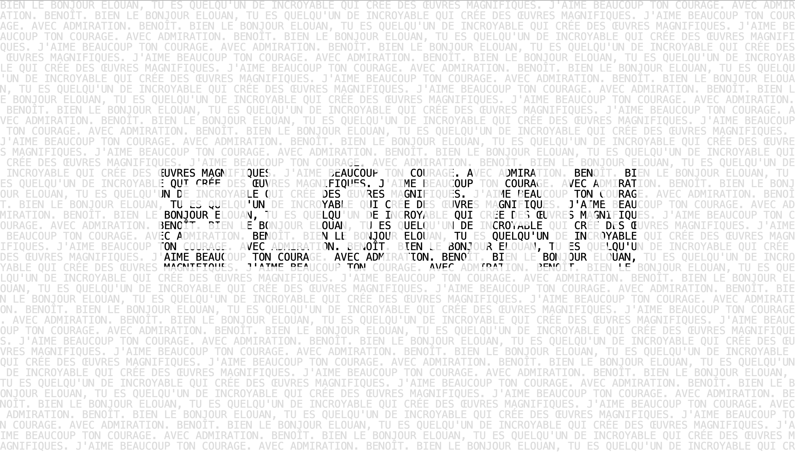

# ASCII Poem

J'ai décidé de créer une œuvre qui génère des poèmes aléatoires via un algorithme ressemblant à Love Letters de Strachey. L'idée vient de faire ressortir le nom de la personne à qui le poème était adressé, mais en se rapprochant de pouvoir lire ce poème. Il y a aussi un veriosn avec une api permettant de lire le début d'article wikipedia.


Ce projet propose **deux modes d’utilisation**.

## 1. Mode avec requête (`title`)

Lorsque le projet est utilisé avec un paramètre `title` dans l’URL, par exemple :

```
/index.html?title=pomme
```

Le programme :

* envoie une requête à l’API de **Wikipedia**
* récupère le **titre** et une **description courte**
* utilise ce contenu comme matière première du texte généré

## 2. Mode sans requête (`title`)

Lorsqu’aucun paramètre `title` n’est présent dans l’URL, le projet réutilise le code développé ce matin dans :

```
[https://github.com/benbrl/Esthetique_et_algorithmique/tree/main/digital_litterature/love_letters_strachey/main.js](https://github.com/benbrl/Esthetique_et_algorithmique/tree/main/digital_litterature/love_letters_strachey/main.js)
```

J’ai simplement modifié le système pour que la phrase reste compréhensible, tout en changeant aléatoirement :

* certains **pronoms**
* **actions**
* **adjectifs**

Cela permet de générer une sorte de **vrai poème variable**, cohérent mais toujours différent.

## Réflexion sur la mise en forme

Après une longue réflexion sur la manière de représenter le texte visuellement, j’ai d’abord envisagé de placer **chaque caractère sur sa propre case**, afin de pouvoir jouer indépendamment sur chacun d’eux et donc de changer leur couleurs.

Cependant, je n’arrivais pas à stocker chaque caractère dans un tableau permettant une manipulation indépendante.

J’ai alors eu l’idée de :

* **dupliquer la grille**
* utiliser **deux couches de couleur** : une grise et une noire
* puis **soustraire le texte du `title`** sur la couche noire


## IA et outils

* Utilisation de l’IA pour **corriger ce README**
* Aide de l’IA pour : concevoir un **masque fonctionnel**

---

## Résultat



---

## Démarrage rapide

Ouvrez le fichier `index.html` dans votre navigateur web, puis modifiez `sketch.js` pour expérimenter.

---

## Lancer le projet en local

Pour les projets utilisant des fichiers médias ou une API, utilisez un serveur local :

```bash
# Avec Python
python -m http.server 8000

# Avec Node.js
npx http-server

# Avec l’extension VS Code Live Server
# Clic droit sur index.html -> "Open with Live Server"
```

---

## Ressources

* [p5.js 2.0](https://beta.p5js.org/)
* [Documentation p5.js](https://p5js.org/reference/)
