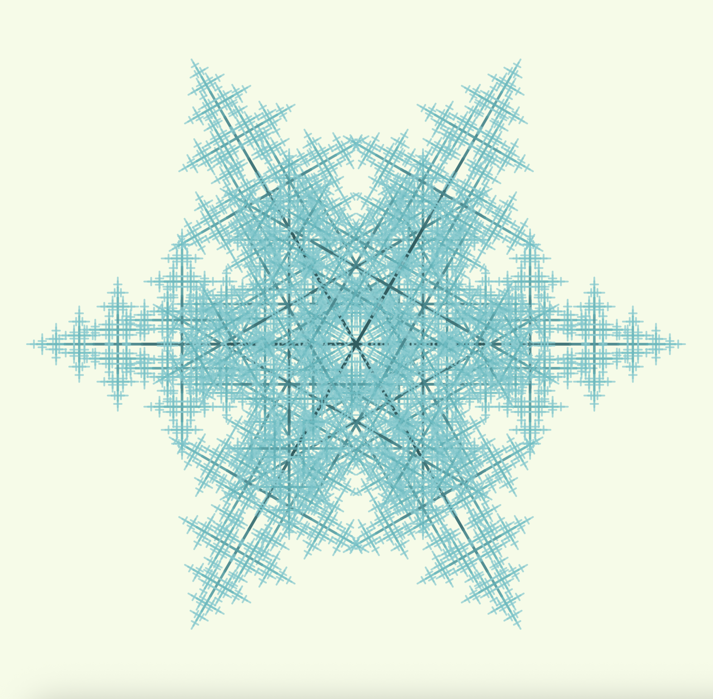

# Tree -> Flower

Après avoir eu du mal à être satisfait de mes deux premiers codes de fractales en 2D et en 3D, j’ai décidé de faire quelque chose de plus simple : travailler uniquement avec des lignes et reprendre le principe de base des fractales.

Au tout début de ce nouveau projet, je souhaitais réaliser quelque chose qui ressemble à ceci :

**Inspiration originale :**
[https://fr.pinterest.com/pin/88523948920853569/](https://fr.pinterest.com/pin/88523948920853569/)

## À propos

Mais le rendu final a complètement pris une autre direction… et c’est finalement en expérimentant que j’ai obtenu une **fleur**, ou parfois un **flocon de neige**, selon les paramètres et les couleurs utilisées !

À la base, pour mon cas, la règle était simplement de tracer un trait.

Après avoir réussi à mettre tout ça en place vers 22h17, je me suis dit qu’il serait intéressant de laisser l’utilisateur trouver lui-même les meilleurs paramètres ! (car le développement, je me suis beaucoup amusé à les modifier pour voir ce qu’il se passait, donc autant en faire une fonctionnalité.)

## Interface et contrôles

Pour cela, j’ai utilisé la librairie **GUI**, qui permet d’ajouter des contrôles en JavaScript.
Dans ce projet, je me suis appuyé sur cet exemple d’utilisation du GUI :

[https://editor.p5js.org/slow_izzm/sketches/rJXAyI7JV](https://editor.p5js.org/slow_izzm/sketches/rJXAyI7JV)

## Résultat



---

## Démarrage rapide

Ouvrez le fichier `index.html` dans votre navigateur web, puis modifiez `sketch.js`.

## Lancer le projet en local

Pour les projets utilisant des fichiers médias ou une API, utilisez un serveur local :

```bash
# Avec Python
python -m http.server 8000

# Avec Node.js
npx http-server

# Avec l’extension VS Code Live Server
# Clic droit sur index.html -> "Open with Live Server"
```

> IA utilisée pour la refactorisation du README.
